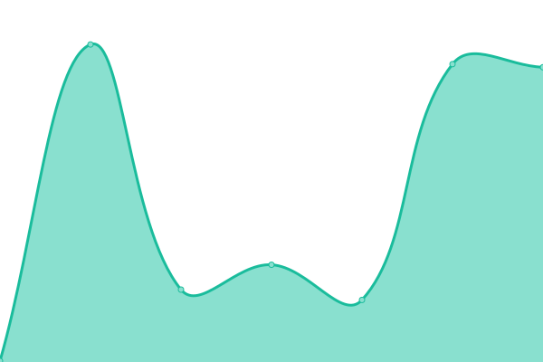

# [📈 Live Status](https://demo.upptime.js.org): <!--live status--> **🟥 Complete outage**

This repository contains the open-source uptime monitor and status page for [萧上晋](https://software.shangjinyun.cn/), powered by [Upptime](https://github.com/upptime/upptime).

With [Upptime](https://upptime.js.org), you can get your own unlimited and free uptime monitor and status page, powered entirely by a GitHub repository. We use [Issues](https://github.com/Shangjin-Xiao/shangjinyun-state/issues) as incident reports, [Actions](https://github.com/Shangjin-Xiao/shangjinyun-state/actions) as uptime monitors, and [Pages](https://demo.upptime.js.org) for the status page.

<!--start: status pages-->
<!-- This summary is generated by Upptime (https://github.com/upptime/upptime) -->
<!-- Do not edit this manually, your changes will be overwritten -->
<!-- prettier-ignore -->
| URL | Status | History | Response Time | Uptime |
| --- | ------ | ------- | ------------- | ------ |
|  [上晋云](https://www.shangjinyun.cn) | 🟥 Down | [.yml](https://github.com/Shangjin-Xiao/shangjinyun-state/commits/HEAD/history/.yml) | 

 310ms
     
 | 

<a href="https://state.shangjinyun.cn/history/">98.69%</a>
    

|  [上晋的blog](https://blog.shangjinyun.cn) | 🟥 Down | [blog.yml](https://github.com/Shangjin-Xiao/shangjinyun-state/commits/HEAD/history/blog.yml) | 

 334ms
     
 | 

<a href="https://state.shangjinyun.cn/history/blog">100.00%</a>
    

|  [上晋云照片](https://photo.shangjinyun.cn) | 🟥 Down | [.yml](https://github.com/Shangjin-Xiao/shangjinyun-state/commits/HEAD/history/.yml) | 

 310ms
     
 | 

<a href="https://state.shangjinyun.cn/history/">98.69%</a>
    

|  [上晋云文件](https://hub.shangjinyun.cn) | 🟥 Down | [.yml](https://github.com/Shangjin-Xiao/shangjinyun-state/commits/HEAD/history/.yml) | 

 310ms
     
 | 

<a href="https://state.shangjinyun.cn/history/">98.69%</a>
    

|  [上晋云AI](https://ai.shangjinyun.cn) | 🟥 Down | [ai.yml](https://github.com/Shangjin-Xiao/shangjinyun-state/commits/HEAD/history/ai.yml) | 

 267ms
     
 | 

<a href="https://state.shangjinyun.cn/history/ai">100.00%</a>
    

|  [shangjinyun-global](https://file.shangjinyun.cn) | 🟥 Down | [shangjinyun-global.yml](https://github.com/Shangjin-Xiao/shangjinyun-state/commits/HEAD/history/shangjinyun-global.yml) | 

 133ms
     
 | 

<a href="https://state.shangjinyun.cn/history/shangjinyun-global">100.00%</a>
    

<!--end: status pages-->

[**Visit our status website →**](https://demo.upptime.js.org)

## 📄 License

- Powered by: [Upptime](https://github.com/upptime/upptime)
- Code: [MIT](./LICENSE) © [Anand Chowdhary](https://anandchowdhary.com), supported by [Pabio](https://pabio.com)
- Data in the `./history` directory: [Open Database License](https://opendatacommons.org/licenses/odbl/1-0/)
